# Activity Diagram Aplikasi Warung Mama Nia POS

Dokumen ini berisi versi sederhana activity diagram untuk Bab 3. Setiap diagram tersedia dalam format PlantUML dan Mermaid.js.

## 1. Activity Diagram Login

### PlantUML

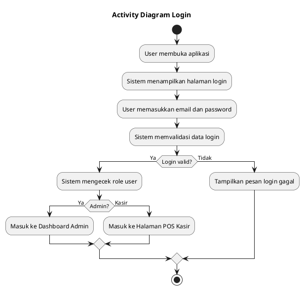

### Mermaid.js

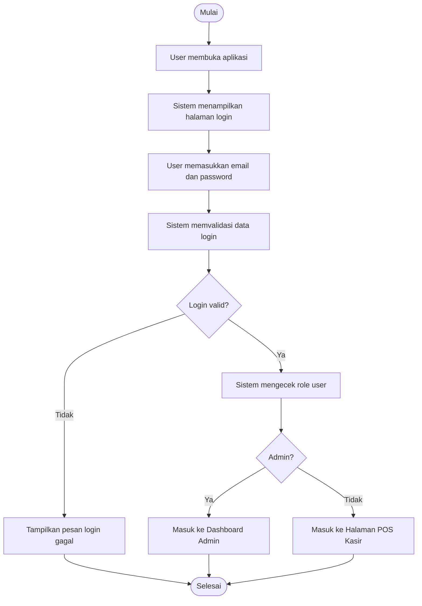

## 2. Activity Diagram Transaksi POS

### PlantUML

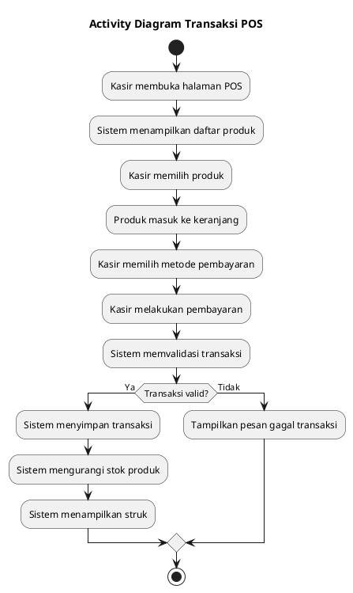

### Mermaid.js

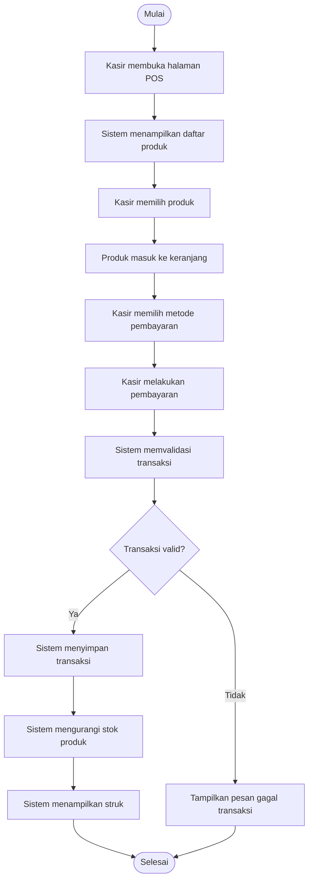

## 3. Activity Diagram Kelola Produk

### PlantUML

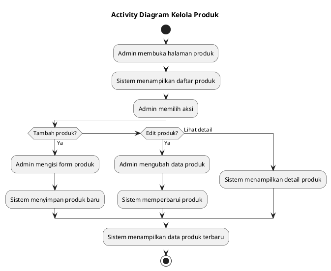

### Mermaid.js

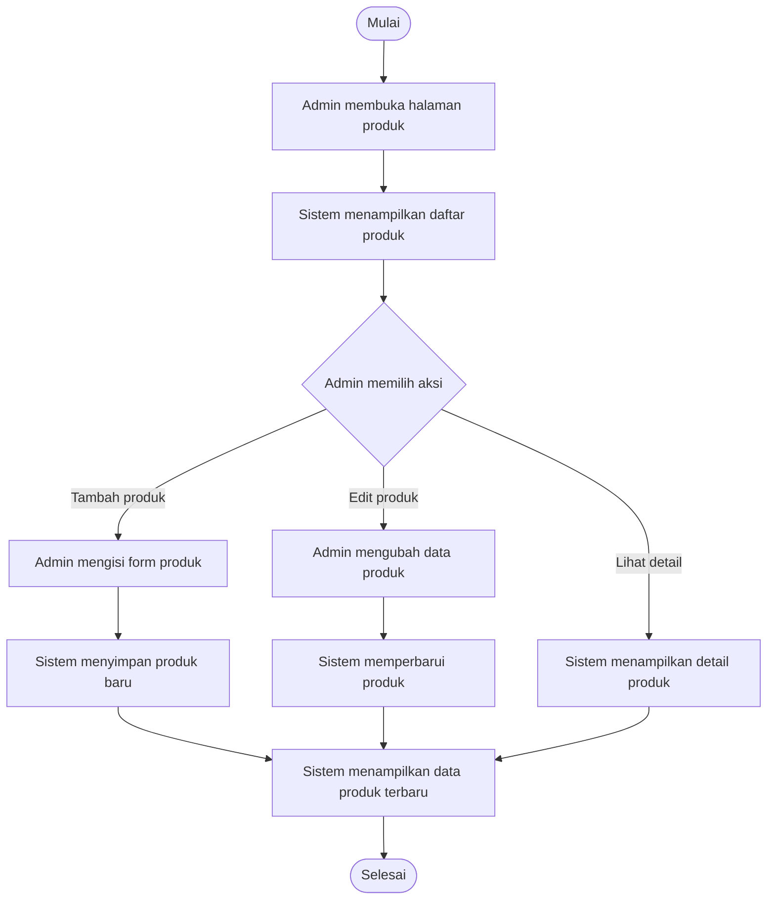

## 4. Activity Diagram Kelola Kategori

### PlantUML

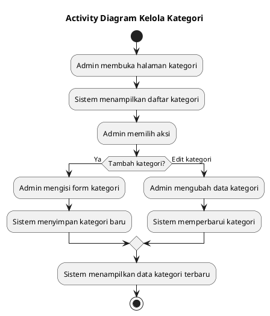

### Mermaid.js

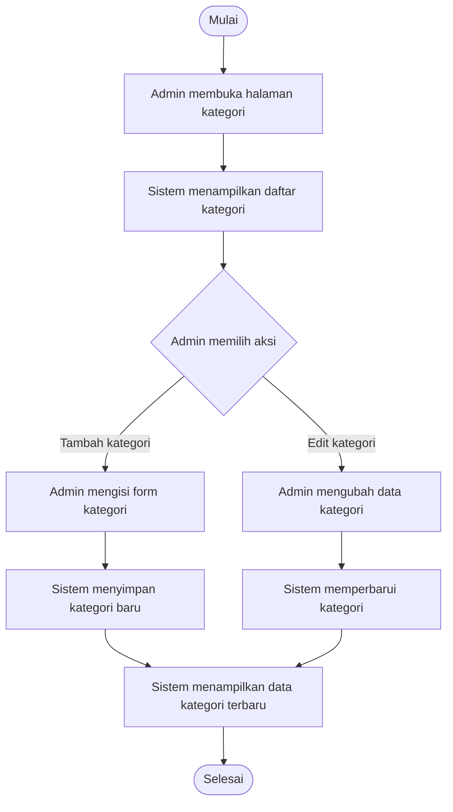

## 5. Activity Diagram Kelola Transaksi

### PlantUML

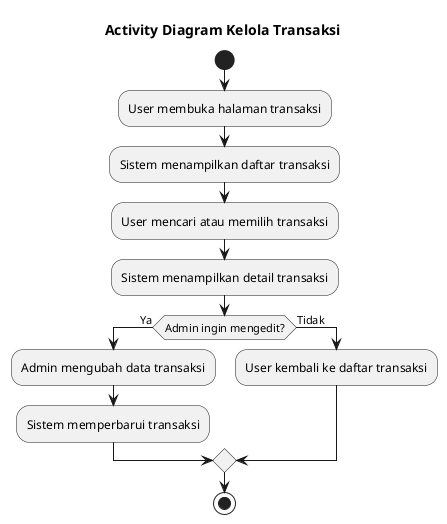

### Mermaid.js

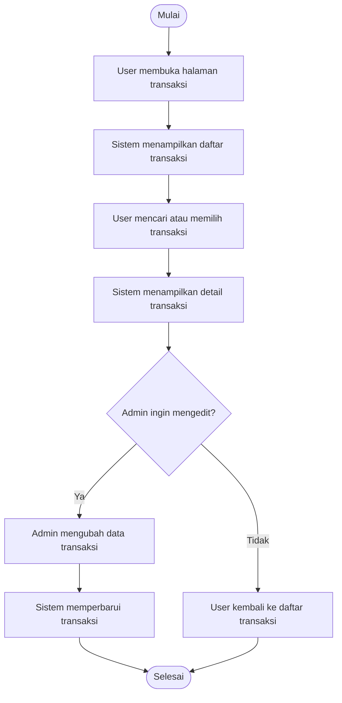

## 6. Activity Diagram Dashboard

### PlantUML

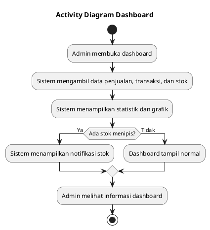

### Mermaid.js

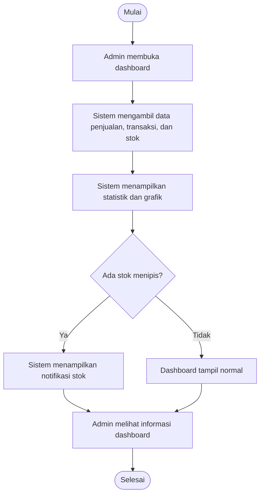

## 7. Activity Diagram Laporan

### PlantUML

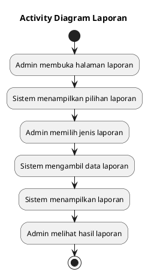

### Mermaid.js

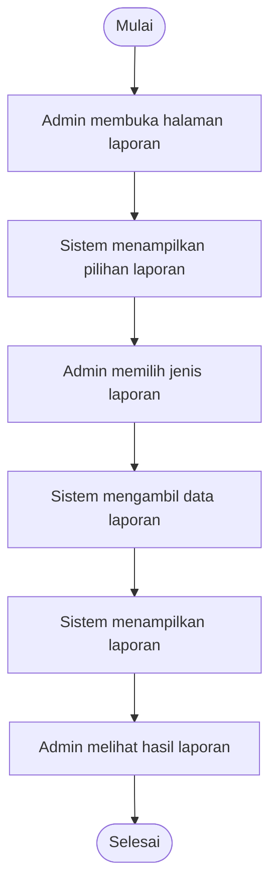

## 8. Activity Diagram Lengkap Sederhana Admin

Diagram ini menggambarkan alur lengkap sisi admin, mulai dari login, dashboard, pengelolaan data, transaksi, laporan, akun, sampai POS.

### PlantUML

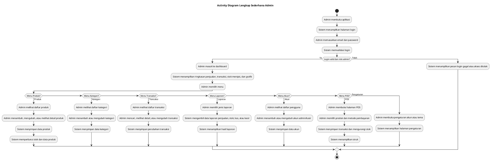

### Mermaid.js

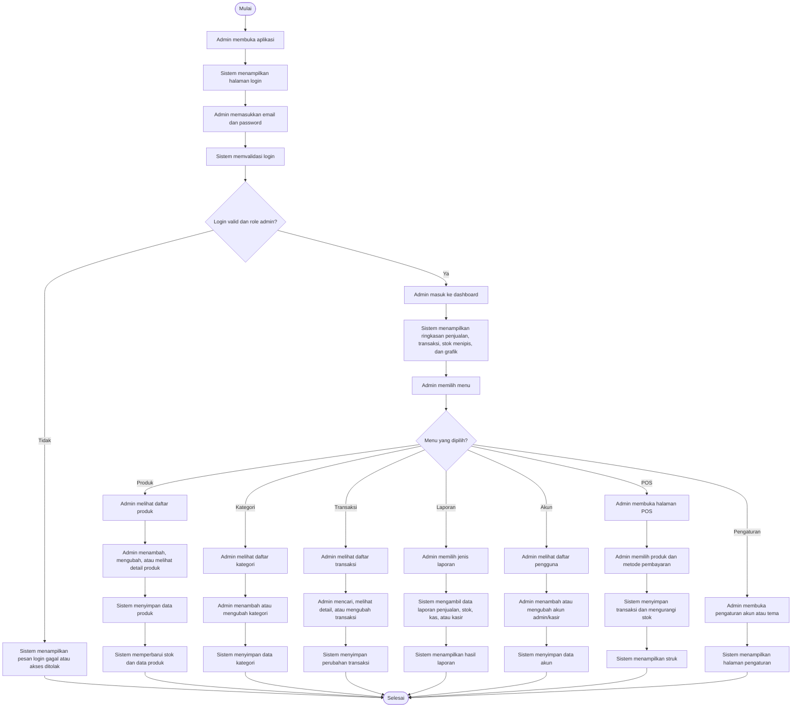

## 9. Activity Diagram Lengkap Sederhana Kasir

Diagram ini menggambarkan alur lengkap sisi kasir, mulai dari login, transaksi POS, riwayat transaksi, sampai pengaturan.

### PlantUML

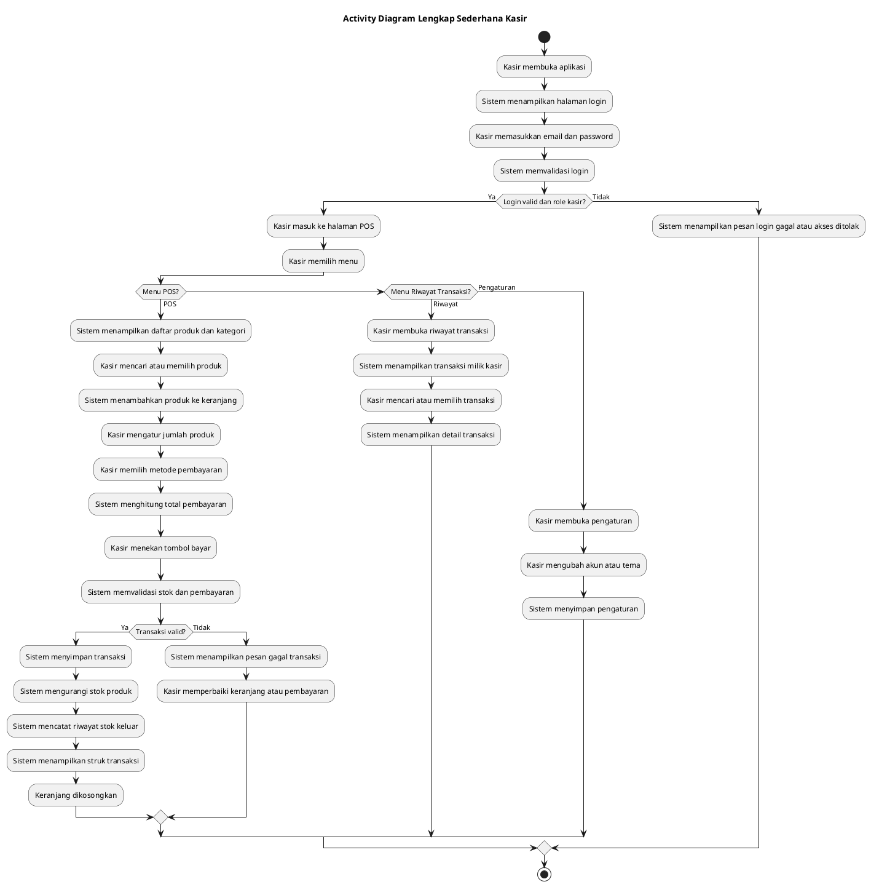

### Mermaid.js

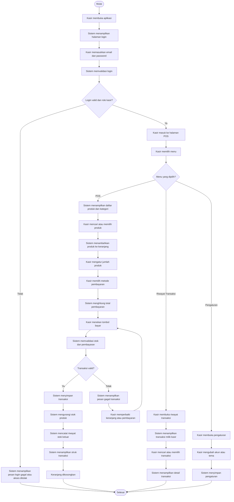

## Catatan

Bagian 8 dan 9 adalah versi yang disarankan untuk Bab 3 jika ingin activity diagram yang lengkap tetapi tetap sederhana dan dipisahkan berdasarkan role admin dan kasir.
