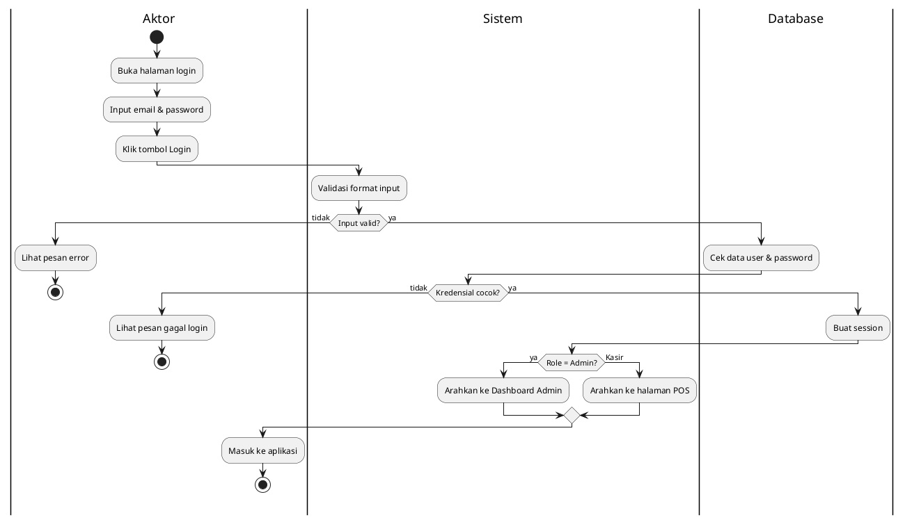
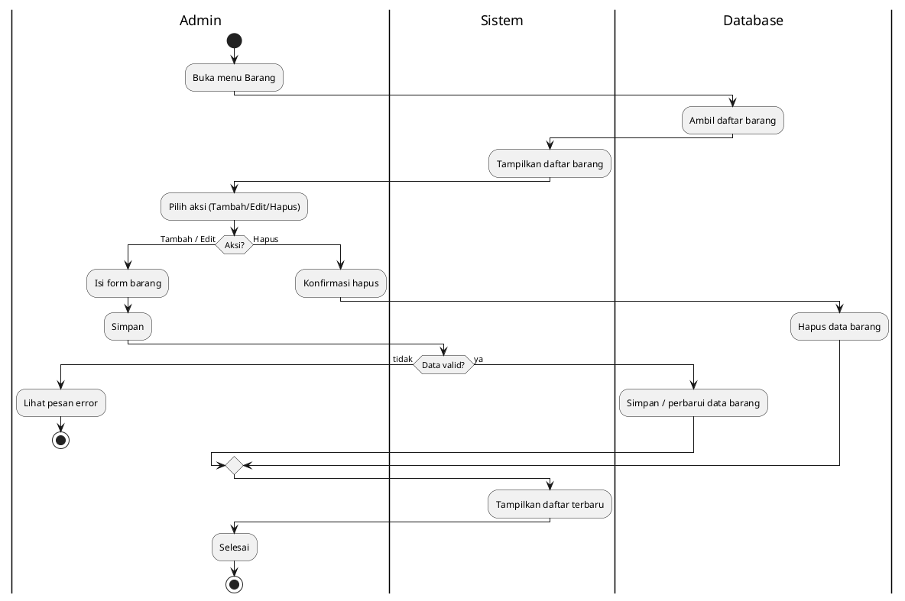
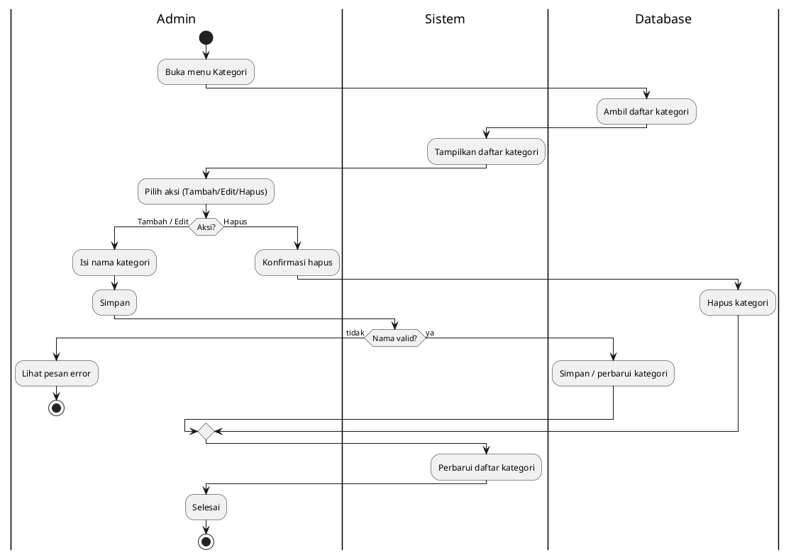
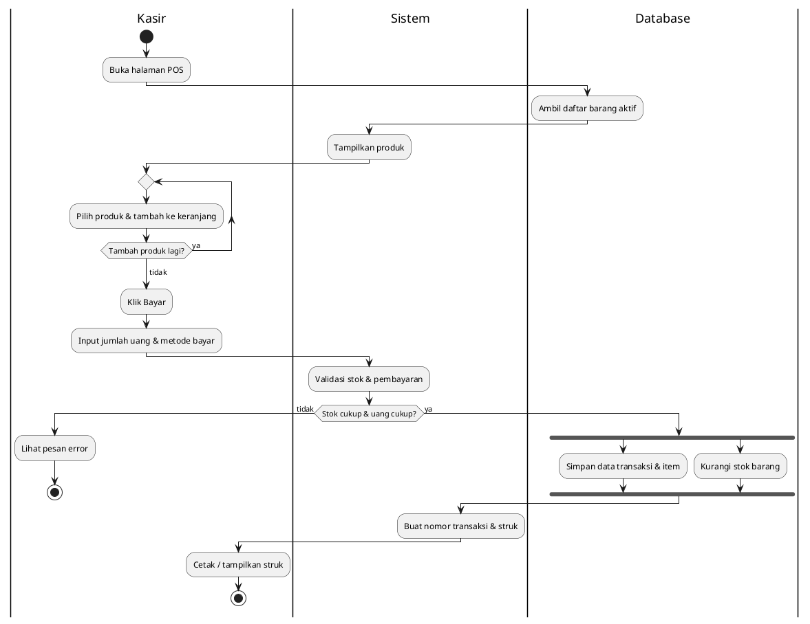
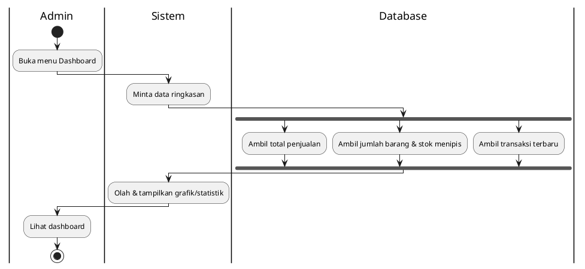
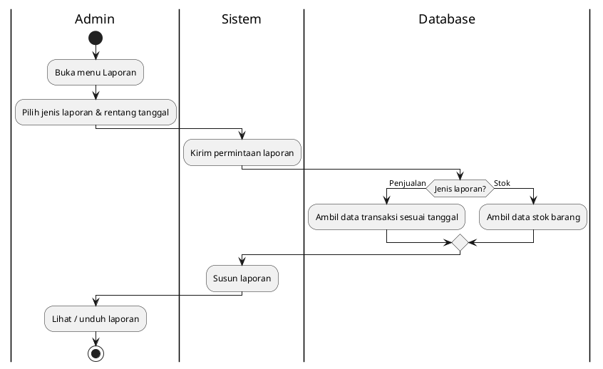
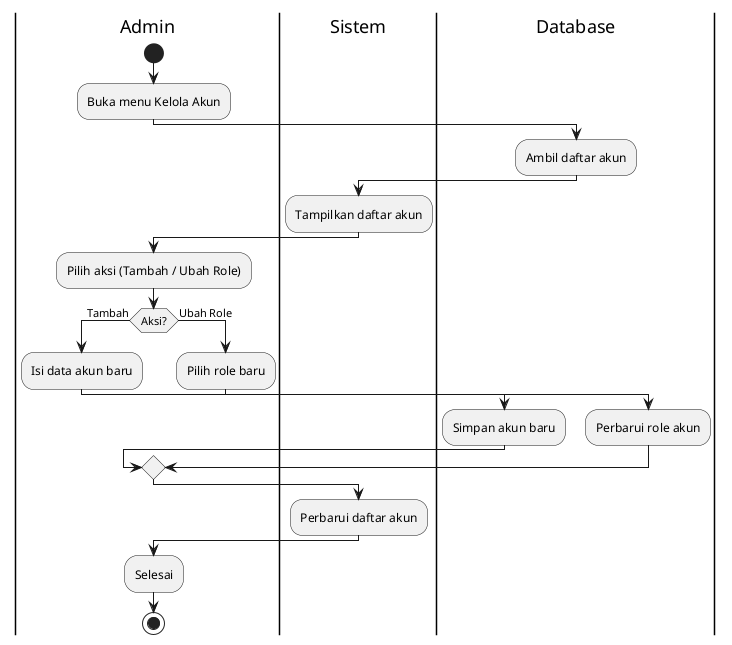
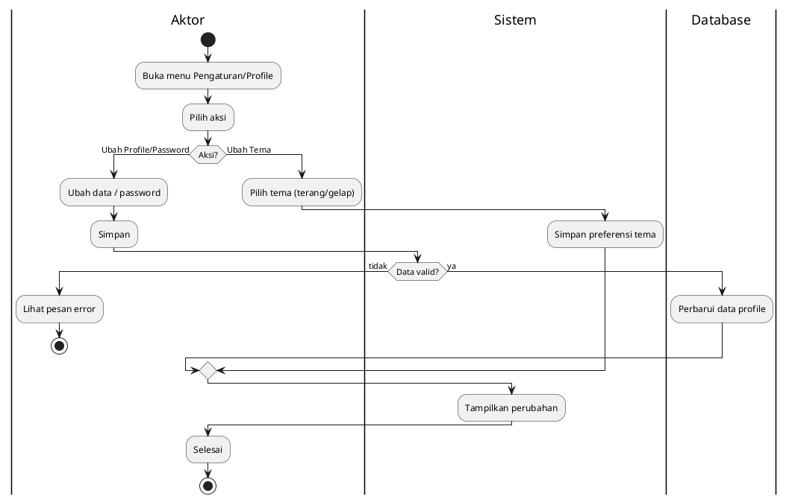
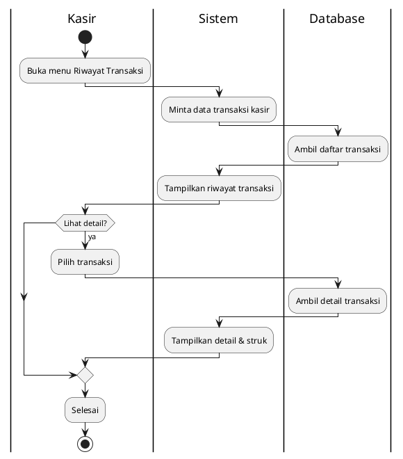
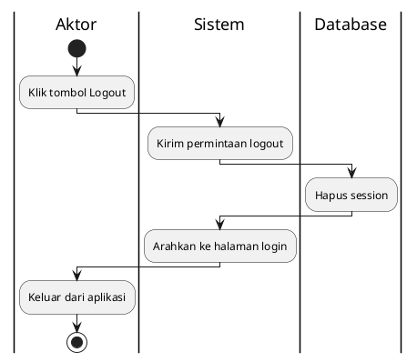

# Activity Diagram — Warung Sembako POS

Setiap diagram menggunakan **swimlane** untuk memisahkan interaksi antara
**Aktor**, **Sistem**, dan **Database**. Notasi PlantUML standar
(`start`, aktivitas, `if/else` decision, `fork/join`, `stop`).

---

## 1. Login

---

## 2. Mengelola Barang (Tambah / Edit / Hapus)

---

## 3. Mengelola Kategori

---

## 4. Melakukan Transaksi Penjualan (POS) — Kasir

---

## 5. Melihat Dashboard — Admin

---

## 6. Melihat Laporan (Stok / Penjualan) — Admin

---

## 7. Mengelola Akun (Ubah Role) — Admin

---

## 8. Mengelola Profile (Ubah Profile/Password & Tema)

---

## 9. Riwayat Transaksi — Kasir

---

## 10. Logout

