# Activity Diagram — Warung Sembako POS

Setiap diagram menggunakan **swimlane** untuk memisahkan interaksi antara
**Aktor**, **Sistem**, dan **Database**. Notasi PlantUML standar
(`start`, aktivitas, `if/else` decision, `fork/join`, `stop`).

---

## 1. Login

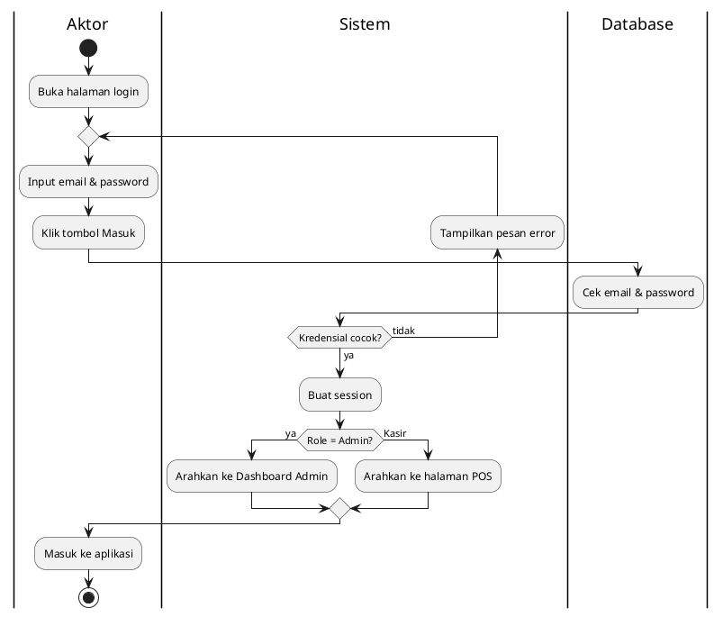

---

## 2. Mengelola Barang (Tambah / Edit / Hapus)

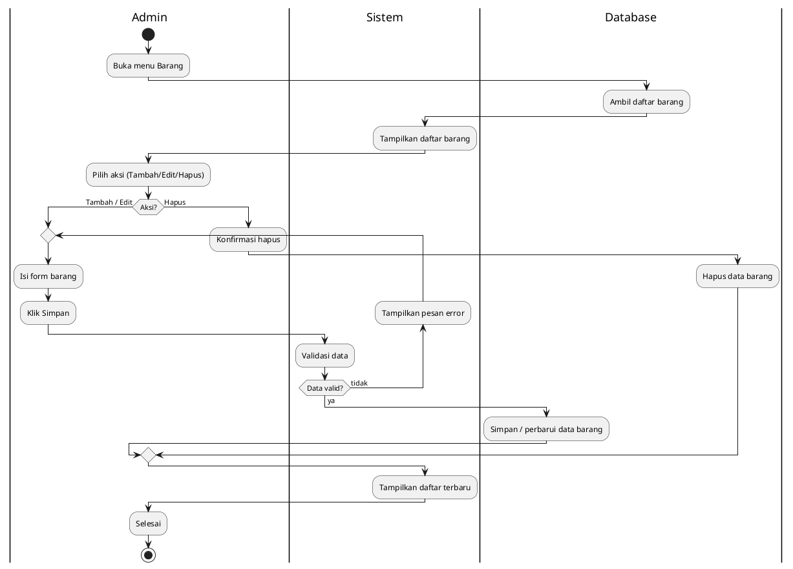

---

## 3. Mengelola Kategori

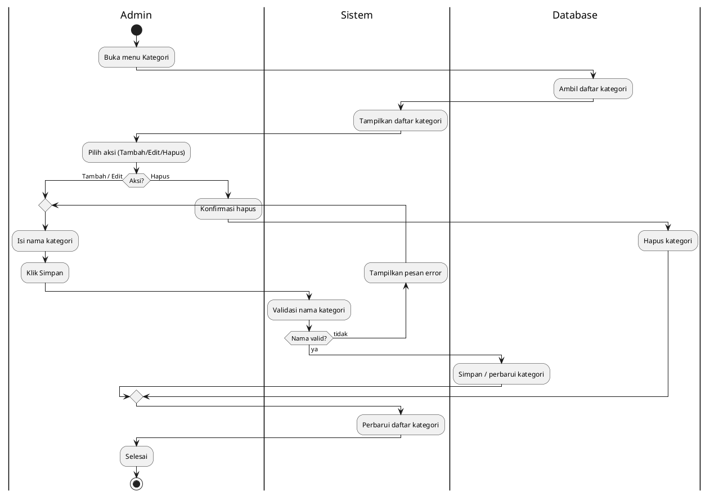

---

## 4. Melakukan Transaksi Penjualan (POS) — Kasir/Admin

> Aktor pada diagram ini dapat berupa **Kasir** maupun **Admin**, karena
> keduanya memiliki use case *Melakukan Transaksi Penjualan* dengan alur
> yang sama.

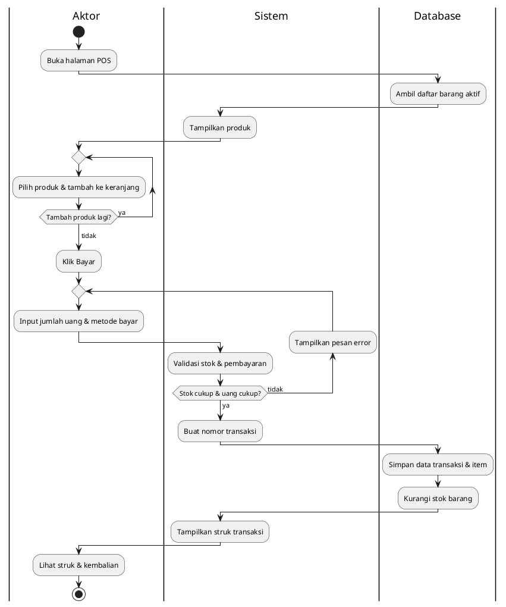

---

## 5. Mengelola Transaksi (Detail / Edit / Hapus) — Admin

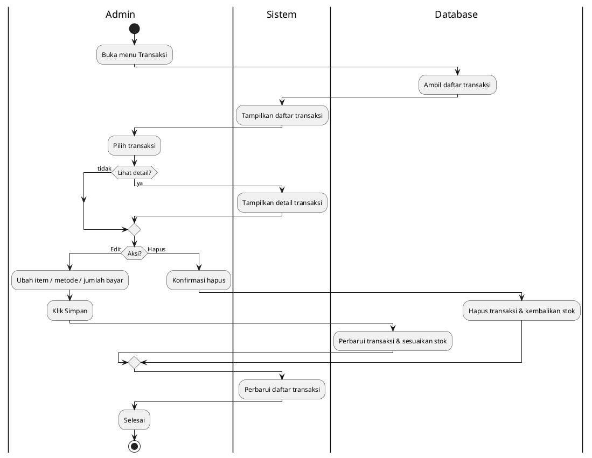

---

## 6. Melihat Dashboard — Admin

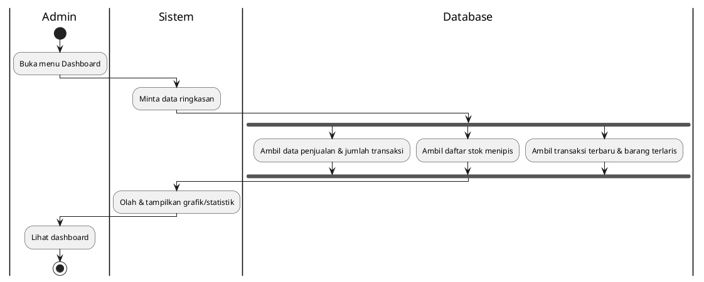

---

## 7. Melihat Laporan (Stok / Penjualan) — Admin

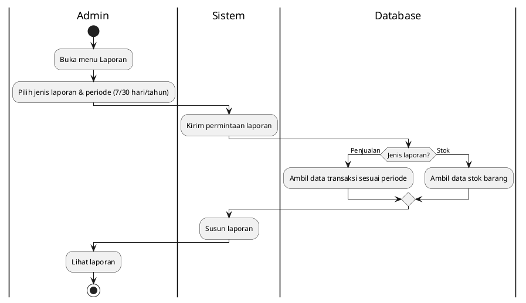

---

## 8. Mengelola Akun (Tambah / Edit / Hapus) — Admin

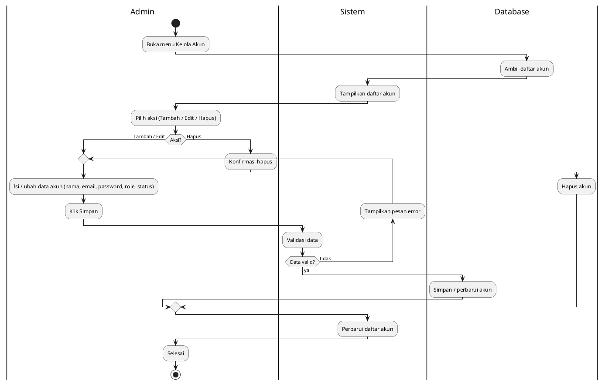

---

## 9. Mengelola Profile (Ubah Profile/Password & Tema)

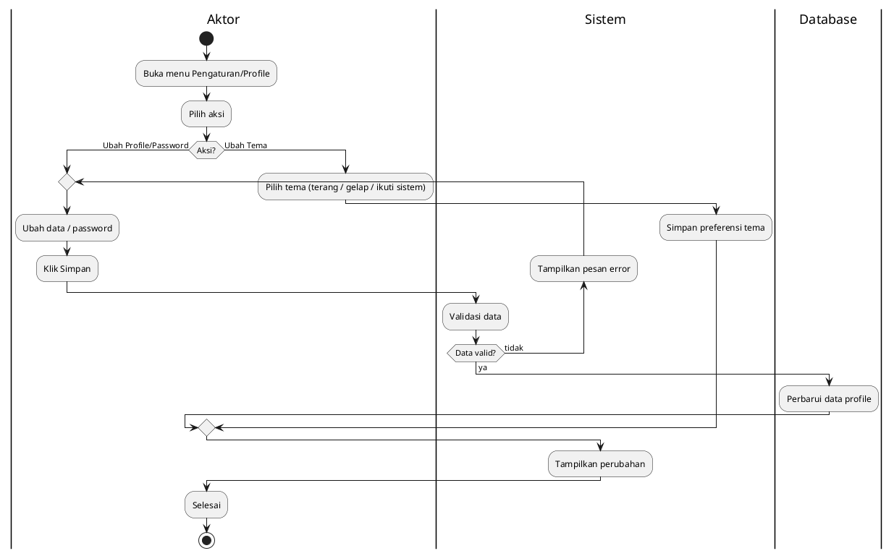

---

## 10. Riwayat Transaksi — Kasir

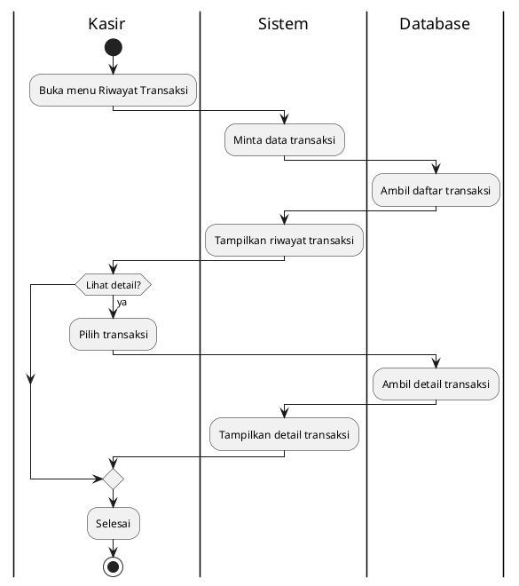

---

## 11. Logout

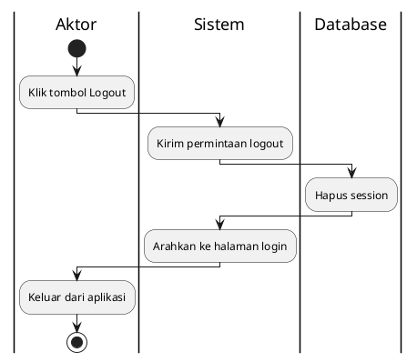
