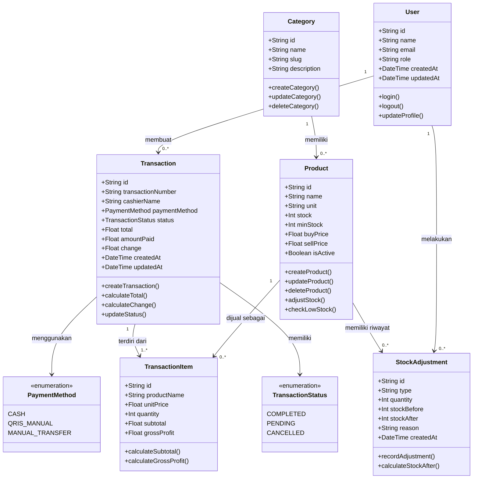

# Class Diagram Aplikasi Warung Mama Nia POS

Dokumen ini berisi rancangan class diagram untuk kebutuhan Bab 3. Class diagram disusun secara sederhana berdasarkan entity utama pada aplikasi, atribut penting, dan relasi antar entitas.

## Diagram Class



## 1. Daftar Class Utama

Class utama pada aplikasi terdiri dari enam entity utama, yaitu `User`, `Category`, `Product`, `Transaction`, `TransactionItem`, dan `StockAdjustment`. Diagram dibuat sederhana agar fokus pada struktur data dan relasi utama yang dibutuhkan dalam penulisan ilmiah.

| No | Nama Class | Jenis Class | Deskripsi |
|----|------------|-------------|-----------|
| 1 | User | Entity | Menyimpan data pengguna aplikasi, baik admin maupun kasir. |
| 2 | Category | Entity | Menyimpan data kategori barang. |
| 3 | Product | Entity | Menyimpan data barang, stok, harga beli, dan harga jual. |
| 4 | Transaction | Entity | Menyimpan data transaksi penjualan. |
| 5 | TransactionItem | Entity | Menyimpan detail barang pada setiap transaksi. |
| 6 | StockAdjustment | Entity | Menyimpan riwayat perubahan stok barang. |

---

## 2. Class User

Class `User` digunakan untuk menyimpan data pengguna aplikasi. Pengguna memiliki role yang membedakan akses antara admin dan kasir.

| Nama | Tipe Data | Keterangan |
|------|-----------|------------|
| id | varchar(32) | Primary key pengguna. |
| name | varchar(100) | Nama pengguna. |
| email | varchar(255) | Email pengguna dan bersifat unik. |
| emailVerified | boolean | Status verifikasi email. |
| image | varchar(500) | Foto profil pengguna. |
| role | varchar(20) | Role pengguna, yaitu admin atau cashier. |
| banned | boolean | Status banned pengguna. |
| banReason | varchar(255) | Alasan pengguna dibanned. |
| banExpires | timestamp | Batas waktu banned pengguna. |
| createdAt | timestamp | Waktu data pengguna dibuat. |
| updatedAt | timestamp | Waktu data pengguna terakhir diperbarui. |

| Method/Operasi | Keterangan |
|---------------|------------|
| login() | Digunakan untuk masuk ke aplikasi. |
| logout() | Digunakan untuk keluar dari aplikasi. |
| updateProfile() | Digunakan untuk memperbarui data profil pengguna. |
| changePassword() | Digunakan untuk mengubah password pengguna. |

**Relasi:**

| Relasi | Keterangan |
|--------|------------|
| User 1..* Transaction | Satu user/kasir dapat membuat banyak transaksi. |
| User 1..* StockAdjustment | Satu user/admin dapat melakukan banyak penyesuaian stok. |

---

## 3. Class Category

Class `Category` digunakan untuk mengelompokkan barang berdasarkan jenisnya, misalnya sembako, minuman, makanan ringan, dan kebutuhan rumah tangga.

| Nama | Tipe Data | Keterangan |
|------|-----------|------------|
| id | varchar(30) | Primary key kategori. |
| name | varchar(100) | Nama kategori dan bersifat unik. |
| slug | varchar(120) | Format URL dari nama kategori dan bersifat unik. |
| description | varchar(500) | Deskripsi kategori. |
| createdAt | timestamp | Waktu kategori dibuat. |
| updatedAt | timestamp | Waktu kategori terakhir diperbarui. |

| Method/Operasi | Keterangan |
|---------------|------------|
| createCategory() | Menambahkan kategori baru. |
| updateCategory() | Mengubah data kategori. |
| deleteCategory() | Menghapus kategori. |
| getProducts() | Mengambil daftar produk berdasarkan kategori. |

**Relasi:**

| Relasi | Keterangan |
|--------|------------|
| Category 1..* Product | Satu kategori dapat memiliki banyak produk. |

---

## 4. Class Product

Class `Product` digunakan untuk menyimpan informasi barang yang dijual pada aplikasi POS.

| Nama | Tipe Data | Keterangan |
|------|-----------|------------|
| id | varchar(30) | Primary key produk. |
| name | varchar(200) | Nama produk. |
| categoryId | varchar(30) | Foreign key ke class Category. |
| image | varchar(500) | URL gambar produk. |
| unit | varchar(50) | Satuan produk, seperti pcs, bungkus, botol, atau kg. |
| stock | integer | Jumlah stok saat ini. |
| minStock | integer | Batas minimal stok. |
| buyPrice | double precision | Harga beli/modal produk. |
| sellPrice | double precision | Harga jual produk. |
| description | varchar(1000) | Deskripsi produk. |
| isActive | boolean | Status aktif produk. |
| createdAt | timestamp | Waktu produk dibuat. |
| updatedAt | timestamp | Waktu produk terakhir diperbarui. |

| Method/Operasi | Keterangan |
|---------------|------------|
| createProduct() | Menambahkan produk baru. |
| updateProduct() | Mengubah data produk. |
| deleteProduct() | Menghapus atau menonaktifkan produk. |
| adjustStock() | Menyesuaikan stok produk. |
| toggleActive() | Mengubah status aktif produk. |
| checkLowStock() | Mengecek apakah stok berada di bawah batas minimum. |

**Relasi:**

| Relasi | Keterangan |
|--------|------------|
| Product *..1 Category | Banyak produk dapat berada pada satu kategori. |
| Product 1..* TransactionItem | Satu produk dapat muncul pada banyak detail transaksi. |
| Product 1..* StockAdjustment | Satu produk dapat memiliki banyak riwayat perubahan stok. |

---

## 5. Class Transaction

Class `Transaction` digunakan untuk menyimpan data transaksi penjualan yang dilakukan oleh kasir.

| Nama | Tipe Data | Keterangan |
|------|-----------|------------|
| id | varchar(30) | Primary key transaksi. |
| transactionNumber | varchar(30) | Nomor transaksi unik. |
| cashierId | varchar(32) | Foreign key ke class User. |
| cashierName | varchar(100) | Nama kasir yang melakukan transaksi. |
| paymentMethod | enum | Metode pembayaran: CASH, QRIS_MANUAL, atau MANUAL_TRANSFER. |
| status | enum | Status transaksi: COMPLETED, PENDING, atau CANCELLED. |
| subtotal | double precision | Total awal sebelum perhitungan akhir. |
| total | double precision | Total akhir transaksi. |
| amountPaid | double precision | Jumlah uang yang dibayarkan pelanggan. |
| change | double precision | Jumlah kembalian. |
| notes | varchar(500) | Catatan transaksi. |
| createdAt | timestamp | Waktu transaksi dibuat. |
| updatedAt | timestamp | Waktu transaksi terakhir diperbarui. |

| Method/Operasi | Keterangan |
|---------------|------------|
| createTransaction() | Membuat transaksi baru. |
| calculateTotal() | Menghitung total transaksi. |
| calculateChange() | Menghitung kembalian. |
| updateStatus() | Mengubah status transaksi. |
| cancelTransaction() | Membatalkan transaksi. |
| getTransactionDetail() | Menampilkan detail transaksi. |

**Relasi:**

| Relasi | Keterangan |
|--------|------------|
| Transaction *..1 User | Banyak transaksi dapat dibuat oleh satu user/kasir. |
| Transaction 1..* TransactionItem | Satu transaksi memiliki banyak item transaksi. |

---

## 6. Class TransactionItem

Class `TransactionItem` digunakan untuk menyimpan detail barang yang dibeli dalam satu transaksi.

| Nama | Tipe Data | Keterangan |
|------|-----------|------------|
| id | varchar(30) | Primary key detail transaksi. |
| transactionId | varchar(30) | Foreign key ke class Transaction. |
| productId | varchar(30) | Foreign key ke class Product. |
| productName | varchar(200) | Nama produk saat transaksi terjadi. |
| unitPrice | double precision | Harga jual produk saat transaksi terjadi. |
| costPrice | double precision | Harga modal produk saat transaksi terjadi. |
| quantity | integer | Jumlah produk yang dibeli. |
| subtotal | double precision | Subtotal item transaksi. |
| grossProfit | double precision | Keuntungan kotor dari item transaksi. |
| createdAt | timestamp | Waktu detail transaksi dibuat. |

| Method/Operasi | Keterangan |
|---------------|------------|
| calculateSubtotal() | Menghitung subtotal item berdasarkan harga dan jumlah. |
| calculateGrossProfit() | Menghitung keuntungan kotor dari item transaksi. |

**Relasi:**

| Relasi | Keterangan |
|--------|------------|
| TransactionItem *..1 Transaction | Banyak item transaksi dimiliki oleh satu transaksi. |
| TransactionItem *..1 Product | Banyak item transaksi dapat mengacu pada satu produk. |

---

## 7. Class StockAdjustment

Class `StockAdjustment` digunakan untuk mencatat setiap perubahan stok barang, baik karena transaksi penjualan, penambahan stok, pengurangan stok, maupun koreksi stok.

| Nama | Tipe Data | Keterangan |
|------|-----------|------------|
| id | varchar(30) | Primary key penyesuaian stok. |
| productId | varchar(30) | Foreign key ke class Product. |
| userId | varchar(32) | Foreign key ke class User. |
| type | varchar(20) | Jenis perubahan stok: IN, OUT, atau CORRECTION. |
| quantity | integer | Jumlah perubahan stok. |
| stockBefore | integer | Stok sebelum perubahan. |
| stockAfter | integer | Stok setelah perubahan. |
| reason | varchar(500) | Alasan perubahan stok. |
| referenceId | varchar(30) | Referensi, misalnya ID transaksi. |
| createdAt | timestamp | Waktu perubahan stok dicatat. |

| Method/Operasi | Keterangan |
|---------------|------------|
| recordAdjustment() | Mencatat perubahan stok. |
| getStockHistory() | Menampilkan riwayat perubahan stok. |
| calculateStockAfter() | Menghitung stok setelah perubahan. |

**Relasi:**

| Relasi | Keterangan |
|--------|------------|
| StockAdjustment *..1 Product | Banyak penyesuaian stok dapat terjadi pada satu produk. |
| StockAdjustment *..1 User | Banyak penyesuaian stok dapat dilakukan oleh satu user. |

---

## 8. Relasi Antar Class

Relasi antar class utama pada aplikasi adalah sebagai berikut.

| No | Class A | Multiplicity | Class B | Keterangan |
|----|---------|--------------|---------|------------|
| 1 | User | 1..* | Transaction | Satu user/kasir dapat membuat banyak transaksi. |
| 2 | User | 1..* | StockAdjustment | Satu user dapat melakukan banyak penyesuaian stok. |
| 3 | Category | 1..* | Product | Satu kategori dapat memiliki banyak produk. |
| 4 | Product | 1..* | TransactionItem | Satu produk dapat muncul pada banyak item transaksi. |
| 5 | Product | 1..* | StockAdjustment | Satu produk dapat memiliki banyak riwayat perubahan stok. |
| 6 | Transaction | 1..* | TransactionItem | Satu transaksi memiliki banyak item transaksi. |

Representasi relasi sederhana:

```text
User              1 -------- * Transaction
User              1 -------- * StockAdjustment
Category          1 -------- * Product
Product           1 -------- * TransactionItem
Product           1 -------- * StockAdjustment
Transaction       1 -------- * TransactionItem
```

---

## 9. Enum yang Digunakan

### 9.1 PaymentMethod

Enum `PaymentMethod` digunakan untuk menentukan metode pembayaran transaksi.

| Nilai | Keterangan |
|-------|------------|
| CASH | Pembayaran tunai. |
| QRIS_MANUAL | Pembayaran menggunakan QRIS manual. |
| MANUAL_TRANSFER | Pembayaran menggunakan transfer manual. |

### 9.2 TransactionStatus

Enum `TransactionStatus` digunakan untuk menentukan status transaksi.

| Nilai | Keterangan |
|-------|------------|
| COMPLETED | Transaksi selesai. |
| PENDING | Transaksi masih menunggu proses. |
| CANCELLED | Transaksi dibatalkan. |

---

## 10. Deskripsi Class Diagram

Class diagram aplikasi Warung Mama Nia POS menggambarkan struktur data dan hubungan antar objek utama dalam sistem. Class `User` merepresentasikan pengguna aplikasi yang terdiri dari admin dan kasir. Admin memiliki akses untuk mengelola barang, kategori, transaksi, laporan, stok, dan akun pengguna, sedangkan kasir memiliki akses utama untuk melakukan transaksi melalui halaman POS.

Class `Category` digunakan untuk mengelompokkan data barang. Setiap `Product` wajib memiliki satu `Category`, sedangkan satu `Category` dapat memiliki banyak `Product`. Class `Product` menyimpan informasi barang seperti nama, satuan, stok, batas minimal stok, harga beli, harga jual, gambar, dan status aktif.

Proses transaksi direpresentasikan oleh class `Transaction` dan `TransactionItem`. Satu `Transaction` dibuat oleh satu `User` sebagai kasir, dan satu transaksi dapat memiliki banyak `TransactionItem`. Setiap `TransactionItem` mengacu pada satu `Product` serta menyimpan data harga dan nama produk pada saat transaksi terjadi agar riwayat transaksi tetap konsisten walaupun data produk berubah di kemudian hari.

Perubahan stok dicatat menggunakan class `StockAdjustment`. Class ini berfungsi sebagai riwayat perubahan stok, baik dari penjualan, penambahan stok, pengurangan stok, maupun koreksi stok. Dengan adanya class ini, sistem dapat melacak perubahan stok berdasarkan produk dan pengguna yang melakukan perubahan.
