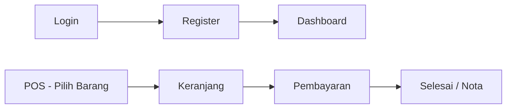
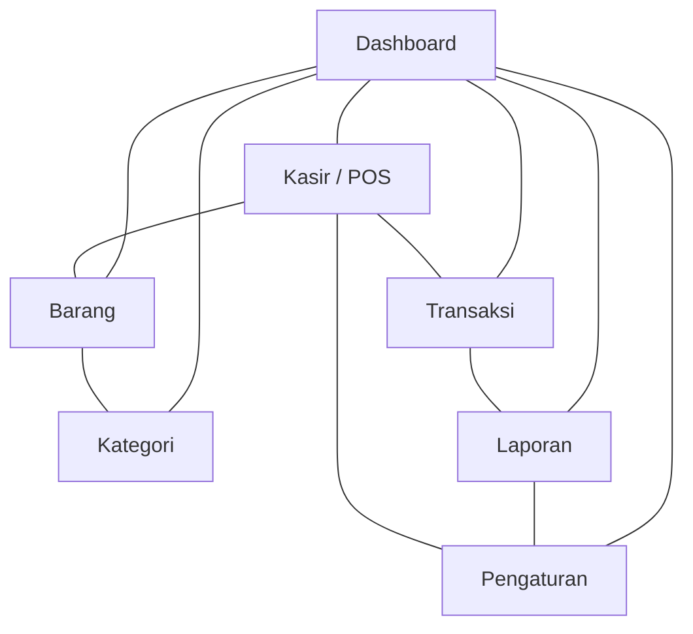
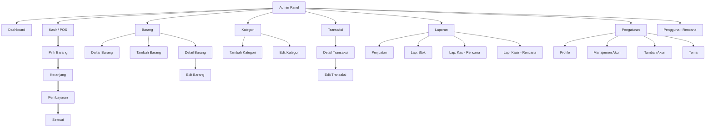
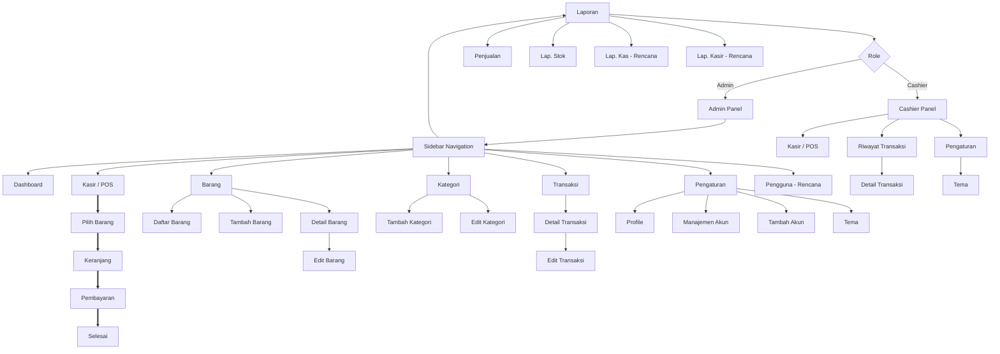

# Diagram Struktur Navigasi — Warung Sembako POS

## 1. Struktur Navigasi Linear (Sequential Navigation)

Pengguna mengikuti alur langkah demi langkah secara berurutan. Tidak ada cabang atau loncatan ke halaman lain.

**Contoh dalam aplikasi:** Proses checkout POS (Pilih Barang → Keranjang → Pembayaran → Selesai) dan alur autentikasi.

---

## 2. Struktur Navigasi Non-Linear (Network Navigation)

Setiap halaman dapat diakses dari halaman mana pun tanpa urutan tetap. Pengguna memiliki kebebasan penuh menjelajah.

**Contoh dalam aplikasi:** Tujuh menu utama Admin (Dashboard, Kasir, Barang, Kategori, Transaksi, Laporan, Pengaturan) — semua flat, bisa diakses kapan saja dalam urutan apa pun.

---

## 3. Struktur Navigasi Hierarkis (Hierarchical / Tree Navigation)

Struktur pohon dengan hubungan parent-child. Navigasi dilakukan dengan turun ke sub-level atau naik ke level di atasnya.

**Contoh dalam aplikasi:** Role bercabang ke Admin/Cashier, lalu tiap menu induk memiliki sub-halaman (Barang → Daftar/Tambah/Detail; Transaksi → Detail/Edit; Laporan → Penjualan/Stok/Kas/Kasir; Pengaturan → Profile/Akun/Tema).

---

## 4. Struktur Navigasi Campuran / Hybrid (Combined Navigation)

Menggabungkan elemen linear, non-linear, dan hierarkis dalam satu arsitektur. Struktur **aktual** dari Warung Sembako POS.

**Tiga tipe dalam satu arsitektur (~38 halaman):**
| Tipe | Bagian | Penjelasan |
|---|---|---|
| **Hierarkis** | Role branch + sub-halaman | Login → Admin / Cashier; tiap menu induk punya anak (Barang → Daftar/Tambah/Detail/Edit; Transaksi → Detail/Edit) |
| **Non-Linear** | Sidebar 7 menu + Cashier 3 menu | Sidebar persisten — dari halaman anak mana pun bisa lompat ke menu utama mana pun |
| **Linear** | POS checkout | Kasir → Pilih Barang → Keranjang → Pembayaran → Selesai (wajib berurutan) |

---

## Ringkasan

| Tipe Struktur | Karakteristik | Ada di Aplikasi |
|---|---|---|
| **Linear** | Berurutan, satu arah | Checkout POS, autentikasi |
| **Non-Linear** | Bebas, semua terhubung | Menu utama Admin & Cashier |
| **Hierarkis** | Pohon, parent-child | Laporan, Pengaturan, Barang |
| **Hybrid/Campuran** | Gabungan ketiganya | **Keseluruhan aplikasi** |
