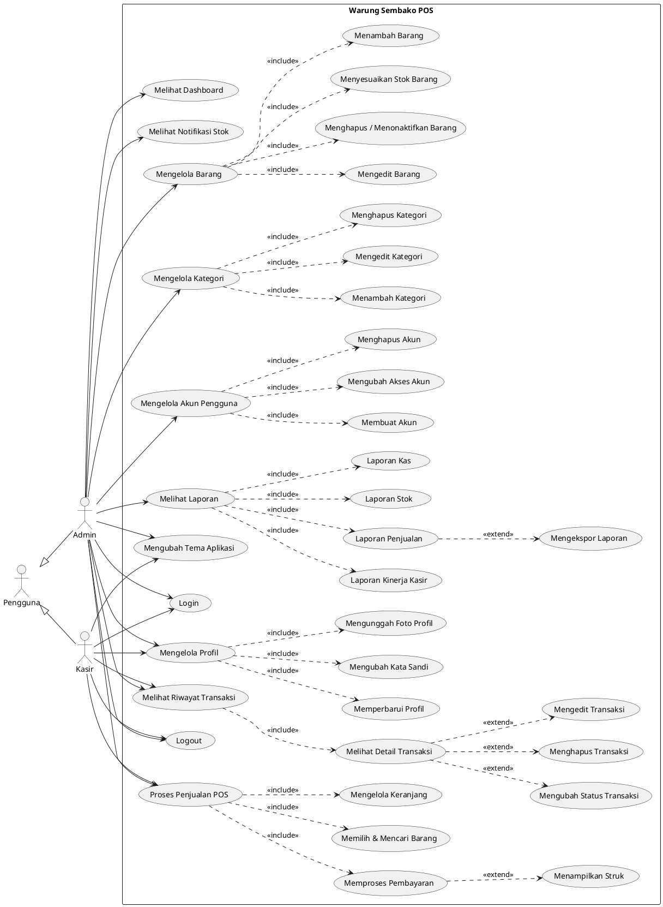
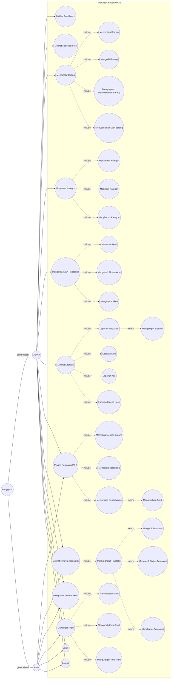

# Use Case Diagram Aplikasi Warung Sembako POS

Dokumen ini berisi use case diagram untuk Bab 3. Setiap diagram tersedia dalam
format PlantUML dan Mermaid.js. Notasi menggunakan relasi:

- **`<<include>>`** : use case wajib dijalankan oleh use case utama (tidak berdiri sendiri).
- **`<<extend>>`** : use case opsional yang dijalankan hanya dalam kondisi tertentu.

Aktor:

- **Pengguna** – aktor dasar (generalisasi dari Admin dan Kasir).
- **Admin** – dapat mengakses seluruh modul manajemen serta modul kasir.
- **Kasir** – hanya dapat mengakses modul POS, riwayat transaksinya sendiri, dan pengaturan pribadi.

---

## 1. Use Case Diagram — Versi PlantUML

---

## 2. Use Case Diagram — Versi Mermaid.js

---

## 3. Penjelasan Relasi

| No | Use Case Utama | Relasi | Use Case Terkait | Alasan |
|----|----------------|--------|------------------|--------|
| 1 | Mengelola Profil | `<<include>>` | Memperbarui Profil, Mengubah Kata Sandi, Mengunggah Foto Profil | Ketiganya selalu dijalankan dalam menu pengaturan profil. |
| 2 | Mengelola Barang | `<<include>>` | Menambah, Mengedit, Menghapus, Menyesuaikan Stok | Semua operasi CRUD adalah bagian tak terpisahkan dari pengelolaan barang. |
| 3 | Mengelola Kategori | `<<include>>` | Menambah, Mengedit, Menghapus Kategori | Operasi dasar pengelolaan kategori. |
| 4 | Mengelola Akun Pengguna | `<<include>>` | Membuat, Mengubah Akses, Menghapus Akun | Alur pengelolaan akun selalu melalui operasi ini. |
| 5 | Melihat Laporan | `<<include>>` | Laporan Penjualan, Stok, Kas, Kinerja Kasir | Melihat laporan berarti melihat salah satu dari keempat laporan. |
| 6 | Proses Penjualan POS | `<<include>>` | Memilih & Mencari Barang, Mengelola Keranjang, Memproses Pembayaran | Penjualan tidak selesai tanpa ketiga langkah ini. |
| 7 | Melihat Riwayat Transaksi | `<<include>>` | Melihat Detail Transaksi | Detail dibuka dari daftar riwayat transaksi. |
| 8 | Memproses Pembayaran | `<<extend>>` | Menampilkan Struk | Struk hanya muncul setelah pembayaran berhasil (opsional/bersyarat). |
| 9 | Melihat Detail Transaksi | `<<extend>>` | Mengedit, Mengubah Status, Menghapus Transaksi | Aksi-aksi ini hanya tersedia secara opsional dari halaman detail (admin). |
| 10 | Laporan Penjualan | `<<extend>>` | Mengekspor Laporan | Ekspor CSV hanya dijalankan jika admin memilih untuk mengunduh. |

> Catatan: Berdasarkan kode (`lib/auth-routes.ts`), Admin juga dapat mengakses seluruh
> halaman kasir (`/cashier/*`), sehingga Admin diberi akses ke use case POS dan
> riwayat transaksi. Aktor **Pengguna** hanya sebagai generalisasi, bukan akun yang
> benar-benar dapat login (pendaftaran akun dilakukan oleh Admin, lihat `app/register/page.tsx`).
