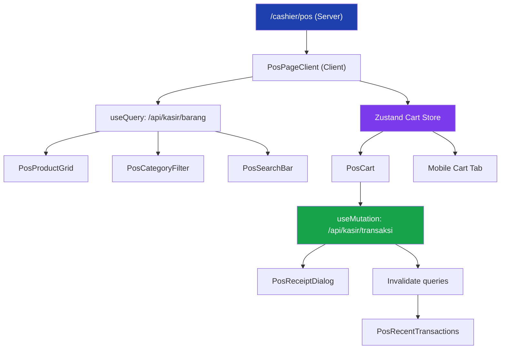

# Implementasi Halaman Kasir (POS)

Mengubah halaman kasir POS dari mockup statis (hardcoded data) menjadi sistem kasir fungsional terintegrasi database, dengan state management, payment flow, dan cetak struk.

## Konteks Saat Ini

| Aspek | Status |
|---|---|
| Route kasir | `/cashier` ada (placeholder), `/cashier/pos` & `/cashier/transaksi` kosong |
| Komponen POS | 7 file di `components/pos/` — **semua statis** (data hardcoded dari `pos-data.ts`) |
| API | Hanya ada `/api/barang` (admin-only) & `/api/kategori` (admin-only) |
| Database | Schema lengkap: Product, Category, Transaction, TransactionItem, StockAdjustment |
| Auth | Better Auth dengan role `admin` & `cashier`, session-based |
| Stack | Next.js 16, TanStack Query, Prisma 7, Zod 4, Tailwind 4, Shadcn UI |

## User Review Required

> [!IMPORTANT]
> **Layout kasir tanpa sidebar** — Halaman kasir (`/cashier/*`) dirancang sebagai standalone layout TANPA sidebar navigasi admin. Kasir hanya butuh akses cepat ke POS dan riwayat transaksi, jadi layout akan minimalis seperti yang sudah ada di `/cashier/page.tsx`.

> [!IMPORTANT]  
> **Fitur struk/receipt** — Struk akan ditampilkan dalam dialog setelah pembayaran berhasil, dengan opsi cetak via `window.print()`. Tidak ada integrasi printer termal khusus di fase ini.

> [!WARNING]
> **Stok auto-decrement** — Ketika transaksi berhasil, stok barang akan otomatis dikurangi di database dan StockAdjustment record dibuat. Pastikan ini sesuai ekspektasi.

## Open Questions

> [!IMPORTANT]
> 1. **Pencarian barang** — Apakah cukup pencarian teks biasa, atau perlu fitur barcode scanning (kamera HP)?
> 2. **Catatan transaksi** — Apakah kasir perlu menambahkan catatan/notes per transaksi?
> 3. **Riwayat transaksi kasir** — Apakah halaman `/cashier/transaksi` (riwayat transaksi milik kasir sendiri) perlu diimplementasikan sekarang, atau fokus POS dulu?
> 4. **Quick amount buttons** — Apakah perlu tombol nominal cepat (Rp50.000, Rp100.000, dll) untuk input uang tunai?

---

## Proposed Changes

### Fase 1: API Endpoints Kasir

Membuat API route baru yang bisa diakses oleh role `cashier` (dan `admin`).

#### [NEW] [route.ts](file:///d:/Download/Documents/gunadarma/gundar/PI/aplikasi/warung-sembako-pos/app/api/kasir/barang/route.ts)

- `GET /api/kasir/barang` — Fetch semua barang aktif + kategori untuk kasir
- Auth: session required, role `cashier` atau `admin`
- Response: `{ products: [...], categories: [...] }`
- Hanya return barang `isActive: true` & `stock > 0`
- Include relasi category untuk filter

#### [NEW] [route.ts](file:///d:/Download/Documents/gunadarma/gundar/PI/aplikasi/warung-sembako-pos/app/api/kasir/transaksi/route.ts)

- `POST /api/kasir/transaksi` — Buat transaksi baru
- Auth: session required, role `cashier` atau `admin`
- Request body:
  ```ts
  {
    items: Array<{ productId: string, quantity: number }>,
    paymentMethod: "CASH" | "QRIS_MANUAL" | "MANUAL_TRANSFER",
    amountPaid: number,
    notes?: string
  }
  ```
- Logic:
  1. Validate semua item (barang aktif, stok cukup)
  2. Generate invoice number `INV-YYYYMMDD-XXXX`
  3. Hitung subtotal, total, change
  4. Create Transaction + TransactionItems dalam `$transaction`
  5. Decrement stok barang
  6. Create StockAdjustment records (type: `OUT`)
  7. Return transaction data + items untuk receipt

- `GET /api/kasir/transaksi` — Fetch riwayat transaksi kasir (opsional, untuk fase lanjut)

#### [NEW] [schemas.ts](file:///d:/Download/Documents/gunadarma/gundar/PI/aplikasi/warung-sembako-pos/app/api/kasir/schemas.ts)

- Zod schema untuk validasi body transaksi
- `createTransactionSchema`: items array, paymentMethod enum, amountPaid number

---

### Fase 2: Cart State Management (Zustand)

Mengganti hardcoded cart data dengan reactive client-side state.

#### [NEW] [use-cart.ts](file:///d:/Download/Documents/gunadarma/gundar/PI/aplikasi/warung-sembako-pos/hooks/use-cart.ts)

- Install `zustand` sebagai dependency
- Zustand store untuk cart management:
  ```ts
  type CartItem = {
    productId: string
    name: string
    price: number       // sellPrice
    costPrice: number   // buyPrice  
    unit: string
    quantity: number
    maxStock: number
  }
  
  type CartStore = {
    items: CartItem[]
    paymentMethod: PaymentMethod
    amountPaid: number
    notes: string
    
    // Actions
    addItem: (product: Product) => void
    removeItem: (productId: string) => void
    updateQuantity: (productId: string, qty: number) => void
    incrementItem: (productId: string) => void
    decrementItem: (productId: string) => void
    setPaymentMethod: (method: PaymentMethod) => void
    setAmountPaid: (amount: number) => void
    setNotes: (notes: string) => void
    clearCart: () => void
    
    // Computed
    subtotal: () => number
    total: () => number
    change: () => number
    itemCount: () => number
  }
  ```

---

### Fase 3: Refactor Komponen POS

Mengubah semua komponen statis menjadi fungsional.

#### [DELETE] [pos-data.ts](file:///d:/Download/Documents/gunadarma/gundar/PI/aplikasi/warung-sembako-pos/components/pos/pos-data.ts)

- Hapus file data statis, diganti dengan data dari API

#### [MODIFY] [pos-page-client.tsx](file:///d:/Download/Documents/gunadarma/gundar/PI/aplikasi/warung-sembako-pos/components/pos/pos-page-client.tsx)

- Integrate TanStack Query: `useQuery` untuk fetch `/api/kasir/barang`
- State management: pencarian, kategori aktif, filtered products
- Connect ke Zustand cart store
- Search bar + category filter yang benar-benar memfilter barang
- Loading/error/empty states
- Hapus semua hardcoded data

#### [MODIFY] [pos-info-bar.tsx](file:///d:/Download/Documents/gunadarma/gundar/PI/aplikasi/warung-sembako-pos/components/pos/pos-info-bar.tsx)

- Props: `cashierName`, `invoiceNumber`, `date`
- Data dari session (nama kasir) dan generated invoice

#### [MODIFY] [pos-category-filter.tsx](file:///d:/Download/Documents/gunadarma/gundar/PI/aplikasi/warung-sembako-pos/components/pos/pos-category-filter.tsx)

- Props: `categories`, `activeCategory`, `onSelect`
- Tambah "Semua" sebagai opsi default
- Controlled component dari parent

#### [MODIFY] [pos-product-grid.tsx](file:///d:/Download/Documents/gunadarma/gundar/PI/aplikasi/warung-sembako-pos/components/pos/pos-product-grid.tsx)

- Props: `products`, `onAddToCart`
- Klik kartu / tombol "Tambah" → `addItem` dari cart store
- Visual feedback saat barang ditambahkan (toast/animation)
- Badge quantity di kartu jika barang sudah ada di keranjang
- Tampilkan gambar barang jika ada (dari UploadThing URL)

#### [MODIFY] [pos-cart.tsx](file:///d:/Download/Documents/gunadarma/gundar/PI/aplikasi/warung-sembako-pos/components/pos/pos-cart.tsx)

- Consume Zustand cart store (bukan hardcoded)
- Qty controls: increment/decrement/remove
- Payment method selector (CASH, QRIS_MANUAL, MANUAL_TRANSFER)
- Input uang diterima dengan formatting Rupiah
- Auto-calculate kembalian
- Tombol "Bayar" → trigger `useMutation` ke `/api/kasir/transaksi`
- Tombol "Hapus Keranjang" → clearCart dengan AlertDialog konfirmasi
- Disabled state saat keranjang kosong
- Loading state saat proses bayar

#### [MODIFY] [pos-recent-transactions.tsx](file:///d:/Download/Documents/gunadarma/gundar/PI/aplikasi/warung-sembako-pos/components/pos/pos-recent-transactions.tsx)

- Fetch 5 transaksi terakhir dari API (kasir ini saja)
- Auto-refresh setelah transaksi baru berhasil (TanStack Query invalidation)

---

### Fase 4: Payment Flow & Receipt

#### [NEW] [pos-receipt-dialog.tsx](file:///d:/Download/Documents/gunadarma/gundar/PI/aplikasi/warung-sembako-pos/components/pos/pos-receipt-dialog.tsx)

- Dialog/Sheet setelah pembayaran berhasil
- Konten struk:
  - Header: nama warung, alamat
  - Info transaksi: nomor invoice, tanggal, kasir
  - Daftar item: nama, qty, harga, subtotal
  - Total pembayaran
  - Metode bayar, uang diterima, kembalian
  - Footer: terima kasih
- Tombol "Cetak Struk" → `window.print()` dengan print-specific CSS
- Tombol "Transaksi Baru" → clear cart & tutup dialog

#### [NEW] [pos-search-bar.tsx](file:///d:/Download/Documents/gunadarma/gundar/PI/aplikasi/warung-sembako-pos/components/pos/pos-search-bar.tsx)

- Input pencarian barang dengan debounce
- Icon search + clear button
- Filter barang berdasarkan nama (case-insensitive)

---

### Fase 5: Route & Layout Kasir

#### [MODIFY] [page.tsx](file:///d:/Download/Documents/gunadarma/gundar/PI/aplikasi/warung-sembako-pos/app/cashier/page.tsx)

- Redirect ke `/cashier/pos` (halaman utama kasir langsung ke POS)

#### [NEW] [layout.tsx](file:///d:/Download/Documents/gunadarma/gundar/PI/aplikasi/warung-sembako-pos/app/cashier/layout.tsx)

- Layout kasir minimalis:
  - Top bar sederhana: logo warung, nama kasir, tombol logout
  - Navigation tabs: POS | Riwayat Transaksi
  - Full-height content area
- Auth guard: redirect ke `/login` jika belum login, `/unauthorized` jika bukan cashier/admin

#### [NEW] [page.tsx](file:///d:/Download/Documents/gunadarma/gundar/PI/aplikasi/warung-sembako-pos/app/cashier/pos/page.tsx)

- Server component: fetch session, pass cashier info ke client component
- Render `PosPageClient` dengan props session

#### [NEW] [page.tsx](file:///d:/Download/Documents/gunadarma/gundar/PI/aplikasi/warung-sembako-pos/app/cashier/transaksi/page.tsx)

- Halaman riwayat transaksi kasir (simplified version)
- List transaksi sendiri, bisa lihat detail

---

### Fase 6: Dependency & Utilities

#### [MODIFY] [package.json](file:///d:/Download/Documents/gunadarma/gundar/PI/aplikasi/warung-sembako-pos/package.json)

- Install `zustand` untuk cart state management

#### [NEW] [format-currency.ts](file:///d:/Download/Documents/gunadarma/gundar/PI/aplikasi/warung-sembako-pos/lib/format-currency.ts)

- Consolidate `formatCurrency` helper (menggabungkan `format.ts` dan `pos-data.ts` formatter)
- Parse formatted Rupiah string back to number
- Format number input with thousand separators

---

## Arsitektur Data Flow



## Verification Plan

### Automated Tests

```bash
# 1. TypeScript check
npm run typecheck

# 2. Build check
npm run build

# 3. Lint
npm run lint
```

### Manual / Browser Verification

1. **Login sebagai kasir** → redirect ke `/cashier/pos`
2. **Barang tampil** dari database (bukan hardcoded)
3. **Filter kategori** memfilter grid barang
4. **Pencarian** memfilter barang real-time
5. **Tambah ke keranjang** → qty bertambah, badge muncul di kartu
6. **Ubah qty** di keranjang (increment/decrement/hapus)
7. **Pilih metode bayar** → CASH/QRIS/Transfer
8. **Input uang** → kembalian otomatis terhitung
9. **Bayar** → transaksi tersimpan di DB, stok berkurang, struk muncul
10. **Cetak struk** → print dialog browser
11. **Transaksi baru** → keranjang bersih, siap transaksi lagi
12. **Responsive** → test di mobile (keranjang slide), tablet, desktop (split view)
13. **Transaksi terakhir** → muncul di sidebar/bawah dan auto-update
