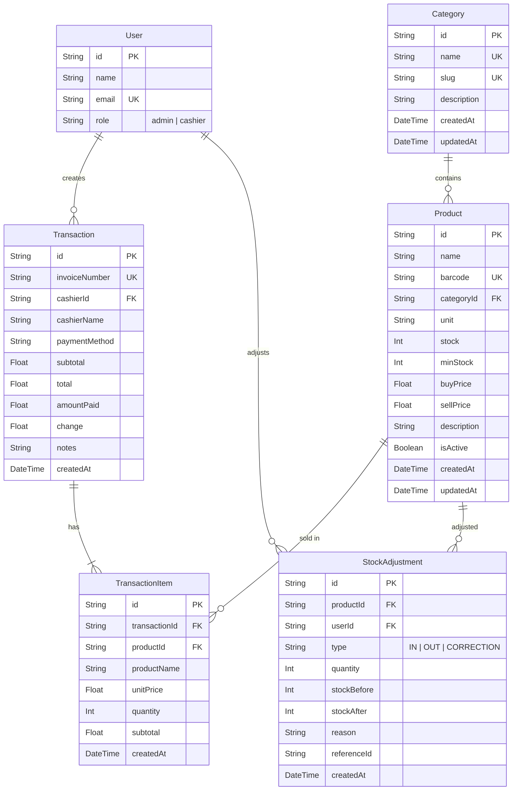

# Rancangan Database Sistem Kasir Warung Sembako

## Konteks

Proyek ini sudah memiliki 4 tabel Better Auth (`User`, `Session`, `Account`, `Verification`) dengan RBAC (admin/cashier). Kita perlu menambahkan model-model bisnis untuk mendukung 5 modul utama: **Inventori, POS, Transaksi, Laporan, dan Stok**.

## Entity Relationship Diagram

## Model Baru yang Ditambahkan

### 1. `Category` — Kategori Barang

Mengelola kategori barang (Sembako, Sabun, Rokok, Minuman, Snack, dll).

| Field | Type | Constraint | Keterangan |
|---|---|---|---|
| `id` | `String` | `@id @default(cuid())` | Primary key |
| `name` | `String` | `@unique` | Nama kategori (contoh: "Sembako") |
| `slug` | `String` | `@unique` | URL-friendly identifier |
| `description` | `String?` | — | Deskripsi opsional |
| `createdAt` | `DateTime` | `@default(now())` | Waktu dibuat |
| `updatedAt` | `DateTime` | `@updatedAt` | Waktu terakhir diupdate |

**Relasi:** One-to-Many → `Product`

---

### 2. `Product` — Data Barang

Model utama inventori. Menyimpan data barang lengkap dengan harga beli, harga jual, stok, dan satuan.

| Field | Type | Constraint | Keterangan |
|---|---|---|---|
| `id` | `String` | `@id @default(cuid())` | Primary key |
| `name` | `String` | — | Nama barang |
| `barcode` | `String?` | `@unique` | Kode barcode (opsional, nullable untuk barang tanpa barcode) |
| `categoryId` | `String` | `FK → Category` | Relasi ke kategori |
| `unit` | `String` | — | Satuan: pcs, bungkus, botol, sachet, dus |
| `stock` | `Int` | `@default(0)` | Stok saat ini |
| `minStock` | `Int` | `@default(5)` | Batas minimum stok (untuk Low Stock Alert) |
| `buyPrice` | `Float` | — | Harga beli (modal) |
| `sellPrice` | `Float` | — | Harga jual |
| `description` | `String?` | — | Deskripsi opsional |
| `isActive` | `Boolean` | `@default(true)` | Soft-delete flag |
| `createdAt` | `DateTime` | `@default(now())` | Waktu dibuat |
| `updatedAt` | `DateTime` | `@updatedAt` | Waktu terakhir diupdate |

**Computed (di aplikasi):** `margin = sellPrice - buyPrice`

**Relasi:**
- Many-to-One → `Category`
- One-to-Many → `TransactionItem`
- One-to-Many → `StockAdjustment`

**Index:**
- `@@index([categoryId])` — Query barang per kategori
- `@@index([name])` — Pencarian barang di POS
- `@@index([isActive])` — Filter barang aktif

---

### 3. `Transaction` — Transaksi Penjualan

Menyimpan setiap transaksi penjualan yang dilakukan kasir.

| Field | Type | Constraint | Keterangan |
|---|---|---|---|
| `id` | `String` | `@id @default(cuid())` | Primary key |
| `invoiceNumber` | `String` | `@unique` | Nomor transaksi unik (format: `INV-YYYYMMDD-XXXX`) |
| `cashierId` | `String` | `FK → User` | ID kasir yang melakukan transaksi |
| `cashierName` | `String` | — | Nama kasir (denormalized, agar tetap tercatat walau user dihapus) |
| `paymentMethod` | `String` | `@default("cash")` | Metode pembayaran: "cash" |
| `subtotal` | `Float` | — | Total sebelum diskon/pajak |
| `total` | `Float` | — | Total pembayaran final |
| `amountPaid` | `Float` | — | Uang yang diterima |
| `change` | `Float` | — | Kembalian (`amountPaid - total`) |
| `notes` | `String?` | — | Catatan opsional |
| `createdAt` | `DateTime` | `@default(now())` | Waktu transaksi |

> [!NOTE]
> `cashierName` sengaja di-denormalize agar laporan tetap akurat meskipun data user di-edit atau dihapus di masa depan.

**Relasi:**
- Many-to-One → `User` (cashier)
- One-to-Many → `TransactionItem`

**Index:**
- `@@index([cashierId])` — Query transaksi per kasir
- `@@index([createdAt])` — Sorting & filter laporan per tanggal
- `@@index([invoiceNumber])` — Lookup cepat by invoice

---

### 4. `TransactionItem` — Item Transaksi

Detail barang yang dibeli dalam setiap transaksi.

| Field | Type | Constraint | Keterangan |
|---|---|---|---|
| `id` | `String` | `@id @default(cuid())` | Primary key |
| `transactionId` | `String` | `FK → Transaction` | Relasi ke transaksi |
| `productId` | `String` | `FK → Product` | Relasi ke barang |
| `productName` | `String` | — | Nama barang saat transaksi (denormalized) |
| `unitPrice` | `Float` | — | Harga jual per unit saat transaksi |
| `quantity` | `Int` | — | Jumlah yang dibeli |
| `subtotal` | `Float` | — | `unitPrice × quantity` |
| `createdAt` | `DateTime` | `@default(now())` | Waktu item dicatat |

> [!IMPORTANT]
> `productName` dan `unitPrice` di-denormalize karena harga barang bisa berubah seiring waktu. Ini memastikan riwayat transaksi tetap akurat sesuai harga saat pembelian.

**Relasi:**
- Many-to-One → `Transaction`
- Many-to-One → `Product`

**Index:**
- `@@index([transactionId])` — Query items per transaksi
- `@@index([productId])` — Analisis penjualan per barang

---

### 5. `StockAdjustment` — Log Perubahan Stok

Mencatat setiap perubahan stok barang, baik karena penjualan, restok, atau koreksi manual.

| Field | Type | Constraint | Keterangan |
|---|---|---|---|
| `id` | `String` | `@id @default(cuid())` | Primary key |
| `productId` | `String` | `FK → Product` | Barang yang stoknya berubah |
| `userId` | `String` | `FK → User` | User yang melakukan perubahan |
| `type` | `String` | — | Tipe: `IN` (restok), `OUT` (penjualan), `CORRECTION` (koreksi manual) |
| `quantity` | `Int` | — | Jumlah perubahan (positif) |
| `stockBefore` | `Int` | — | Stok sebelum perubahan |
| `stockAfter` | `Int` | — | Stok setelah perubahan |
| `reason` | `String?` | — | Alasan perubahan |
| `referenceId` | `String?` | — | ID referensi (misal: Transaction ID) |
| `createdAt` | `DateTime` | `@default(now())` | Waktu perubahan |

> [!TIP]
> Model `StockAdjustment` berfungsi sebagai audit trail untuk setiap perubahan stok. Ini membantu pemilik toko melacak kapan stok berubah, siapa yang mengubahnya, dan mengapa — sehingga mempermudah investigasi jika terjadi selisih stok.

**Relasi:**
- Many-to-One → `Product`
- Many-to-One → `User`

**Index:**
- `@@index([productId])` — Riwayat stok per barang
- `@@index([userId])` — Riwayat perubahan stok per user
- `@@index([createdAt])` — Timeline perubahan stok

---

## Tabel Mapping ke PostgreSQL

Semua model menggunakan `@@map()` dengan format **snake_case** agar konsisten dengan tabel Better Auth yang sudah ada:

| Prisma Model | PostgreSQL Table |
|---|---|
| `Category` | `category` |
| `Product` | `product` |
| `Transaction` | `transaction` |
| `TransactionItem` | `transaction_item` |
| `StockAdjustment` | `stock_adjustment` |

---

## Seed Data

Setelah schema di-push, akan dibuat seed script (`prisma/seed.ts`) dengan data awal:

### Kategori Default
| Nama | Slug |
|---|---|
| Sembako | sembako |
| Sabun & Deterjen | sabun-deterjen |
| Rokok | rokok |
| Minuman | minuman |
| Snack | snack |
| Bumbu Dapur | bumbu-dapur |
| Obat & Kesehatan | obat-kesehatan |
| ATK & Lainnya | atk-lainnya |

### Barang Contoh (beberapa per kategori)
Beberapa barang sampel per kategori dengan data harga beli, harga jual, stok, dan satuan yang realistis.

---

## Proposed Changes

### Prisma Schema

#### [MODIFY] [schema.prisma](file:///d:/Download/Documents/gunadarma/gundar/PI/aplikasi/warung-sembako-pos/prisma/schema.prisma)

Menambahkan 5 model baru (`Category`, `Product`, `Transaction`, `TransactionItem`, `StockAdjustment`) dengan relasi ke model `User` yang sudah ada. Menambahkan field relasi `transactions` dan `stockAdjustments` ke model `User`.

### Seed Script

#### [NEW] [seed.ts](file:///d:/Download/Documents/gunadarma/gundar/PI/aplikasi/warung-sembako-pos/prisma/seed.ts)

Script untuk mengisi data awal: kategori default dan beberapa barang contoh.

#### [MODIFY] [package.json](file:///d:/Download/Documents/gunadarma/gundar/PI/aplikasi/warung-sembako-pos/package.json)

Menambahkan konfigurasi `prisma.seed` agar `npx prisma db seed` bisa dijalankan.

---

## Verification Plan

### Automated
1. `npx prisma validate` — Pastikan schema valid
2. `npx prisma db push` — Push schema ke database
3. `npx prisma db seed` — Jalankan seed data
4. `npx prisma studio` — Verifikasi visual data di browser

### Manual
- Pastikan semua tabel terbuat di PostgreSQL
- Cek relasi antar tabel sudah benar
- Pastikan index terbuat untuk performa query
